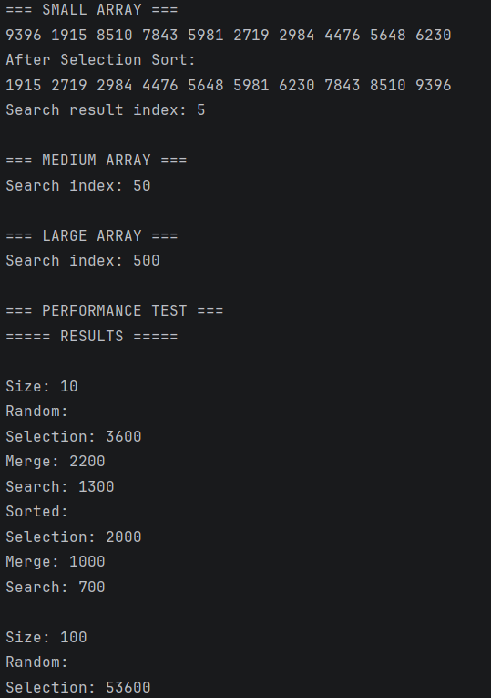
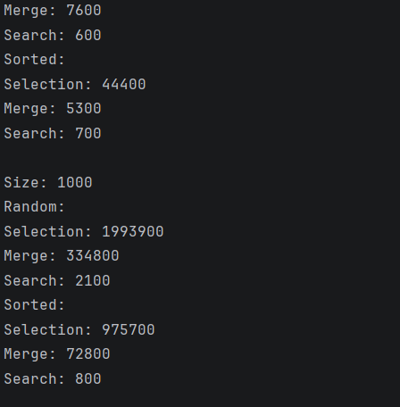
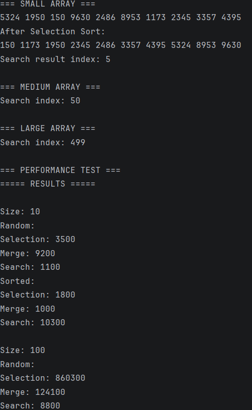
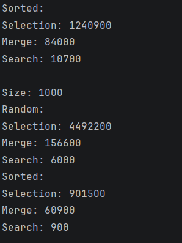

# Sorting and Searching Algorithm Analysis System

## Project Overview

This project implements and compares three algorithms:

- Selection Sort (Basic Sorting)
- Merge Sort (Advanced Sorting)
- Binary Search (Searching)

The purpose of this experiment is to analyze how algorithm performance changes with different input sizes (small, medium, large) and input types (random and sorted arrays). Execution time is measured using System.nanoTime().

## Algorithm Descriptions

### Selection Sort
Selection Sort works by repeatedly finding the smallest element in the unsorted portion of the array and placing it in its correct position.

**Time Complexity:**
- Best Case: O(n²)
- Average Case: O(n²)
- Worst Case: O(n²)

### Merge Sort
Merge Sort uses a divide-and-conquer approach. It splits the array into smaller parts, sorts them recursively, and then merges them back together.

**Time Complexity:**
- Best Case: O(n log n)
- Average Case: O(n log n)
- Worst Case: O(n log n)

### Binary Search
Binary Search finds an element in a sorted array by repeatedly dividing the search space in half.

**Time Complexity:**
- Best Case: O(1)
- Average Case: O(log n)
- Worst Case: O(log n)

Binary Search requires a sorted array because it compares the target value with the middle element to decide which half to search.

## Experimental Results

The following table shows execution times measured in nanoseconds (ns):

| Array Size | Input Type | Selection Sort (ns) | Merge Sort (ns) | Binary Search (ns) |
|------------|------------|--------------------|-----------------|--------------------|
| 10         | Random     | 3600               | 2200            | 1300               |
| 10         | Sorted     | 2000               | 1000            | 700                |
| 100        | Random     | 53600              | 7600            | 600                |
| 100        | Sorted     | 44400              | 5300            | 700                |
| 1000       | Random     | 1993900            | 334800          | 2100               |
| 1000       | Sorted     | 975700             | 72800           | 800                |

## Performance Analysis

### Which sorting algorithm performed faster? Why?

Merge Sort performed faster than Selection Sort, especially for medium and large arrays. This is because Merge Sort has a time complexity of O(n log n), while Selection Sort has O(n²). As the input size increases, Selection Sort becomes significantly slower.

### How does performance change with input size?

As the input size increases, execution time increases for all algorithms. However, Selection Sort grows much faster in time compared to Merge Sort. Merge Sort handles large datasets more efficiently.

### How does sorted vs unsorted data affect performance?

Selection Sort performs slightly better on sorted arrays, but the difference is small because it still checks all elements. Merge Sort performs similarly on both sorted and unsorted arrays since it always follows the same process. Binary Search performs consistently since it always uses sorted data.

### Do the results match the expected Big-O complexity?

Yes, the results match the expected Big-O complexity. Merge Sort performs much better on large inputs, confirming its O(n log n) complexity compared to Selection Sort’s O(n²).

### Which searching algorithm is more efficient? Why?

Binary Search is very efficient because it reduces the search space by half in each step. This results in O(log n) time complexity, making it much faster than checking each element one by one.

### Why does Binary Search require a sorted array?

Binary Search requires a sorted array because it relies on comparing the middle element with the target. This comparison allows the algorithm to eliminate half of the remaining elements at each step.

## Reflection

This assignment helped me understand how different algorithms perform under various conditions. I learned that even though multiple algorithms can solve the same problem, their efficiency can differ significantly.

One key insight is that Merge Sort is much more efficient than Selection Sort for large datasets. I also learned that Binary Search is extremely fast but requires sorted data to function correctly.

A challenge I faced was organizing the program into multiple classes and correctly measuring execution time using System.nanoTime(). This project improved my understanding of object-oriented programming and algorithm performance analysis.

## Screenshots

### Run 1

### Run 2

